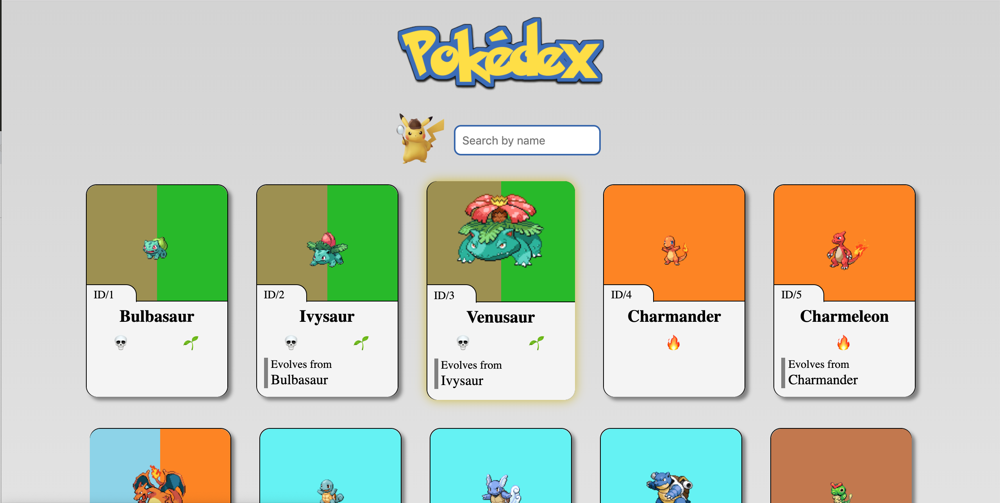
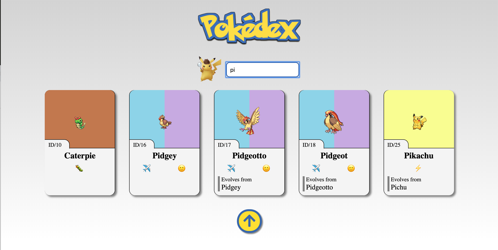

# Pokédex by SuperAnika 

This exercise is a list of Pokemons taken from the API https://pokeapi.co/.


 


It shows a list of pokemons and their information: image, id, name and type.

It also has a search input where you can search pokemons by name.  





At the bottom you can find a button that takes you to the top of the page again.

This site has a responsive design so it can fit all devices' sizes.

You can clone this project clicking on the green clone button or with this link:

https://github.com/Adalab/f-online-pokemon-superanika.git

This project was bootstrapped with [Create React App](https://github.com/facebook/create-react-app) and Sass and you should run "npm start" on your Terminal to init it.

The structure is as follows:
```
/
`- src
   |- components
   |    |- Card
   |    |  |- Card.js
   |    |  |- Card.scss
   |    |- PokeList
   |    |   |- PokeList.js
   |    |   |- PokeList.scss
   |    |- SeachField
   |    |   |- SearchField.js
   |    |   |- SearchField.scss
   |- services
   |- images
   |- App.js
   |- App.scss
   |- index.js
   |- index.css
 ```  
 
